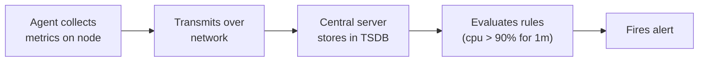
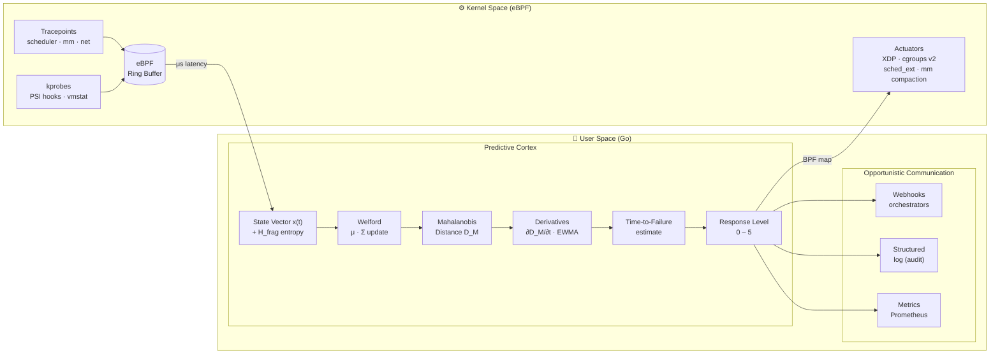

<p align="center">
  <h1 align="center">HOSA</h1>
  <p align="center"><strong>Homeostasis Operating System Agent</strong></p>
  <p align="center">
    An autonomous nervous system for Linux.<br/>
    Detects, contains, and stabilizes system collapse in milliseconds — before your monitoring even notices.
  </p>
</p>

<p align="center">
  <a href="#how-it-works">How It Works</a> •
  <a href="#the-problem">The Problem</a> •
  <a href="#quick-start">Quick Start</a> •
  <a href="#architecture">Architecture</a> •
  <a href="#roadmap">Roadmap</a> •
  <a href="docs/math_model.md">Math Model</a> •
  <a href="docs/architecture.md">Deep Dive</a>
</p>

<p align="center">
  
  = 5.8" />
  
  
  
</p>

---

## The Lethal Interval

Your server crashes in **2 seconds**. Your monitoring detects it in **100**.

That gap — the milliseconds between the start of a collapse and the arrival of the first useful metric at your control plane — is what we call the **Lethal Interval**. It's where systems die while the observer has no idea anything is wrong.

<table>
<thead>
<tr>
  <th></th>
  <th align="center">0s</th>
  <th align="center">1s</th>
  <th align="center">2s</th>
  <th align="center" colspan="3">2s ⇢ 8s</th>
  <th align="center">8s</th>
  <th align="center">100s</th>
</tr>
</thead>
<tbody>
<tr>
  <td><strong>✅ With HOSA</strong></td>
  <td align="center">⚠️ Leak starts</td>
  <td align="center">🔍 Detects</td>
  <td align="center" colspan="4">🛡️ Contains · memory.high throttle</td>
  <td align="center">✅ Stabilized</td>
  <td align="center">📋 Operator notified<br/><em>with full context</em></td>
</tr>
<tr>
  <td><strong>❌ Without HOSA</strong></td>
  <td align="center" colspan="4">💀 Lethal Interval · undetected collapse</td>
  <td align="center" colspan="2">crash → 502<br/>CrashLoopBackOff</td>
  <td align="center">💥 OOM-Kill</td>
  <td align="center">🚨 Prometheus alert<br/><em>(too late)</em></td>
</tr>
</tbody>
</table>

> **HOSA doesn't replace your monitoring. It keeps your node alive until your monitoring can do its job.**

---

## The Problem

Modern infrastructure monitoring (Prometheus, Datadog, Grafana) follows the same pattern:



Every step adds latency. The central server makes decisions based on a **statistically stale snapshot** of the remote node. When collapse is fast — OOM kills, memory leaks, DDoS floods, fork bombs — the mitigation arrives after the damage is done.

Worse: when the network fails, the node loses **both** the ability to report **and** to receive instructions. It operates in complete blindness.

HOSA fixes this by putting the decision-making **on the node itself**.

---

## How It Works

HOSA is a **bio-inspired, autonomous agent** modeled on the human nervous system — from the spinal reflex arc (Phase 1) to the sympathetic nervous system (Phase 2) to the prefrontal cortex (Phase 8).

### Detection: Mahalanobis Distance

Instead of static thresholds (`cpu > 90%`), HOSA learns the **normal behavioral profile** of your node — the correlations between CPU, memory, I/O, network, and scheduler metrics — and detects deviations from that profile using the [Mahalanobis Distance](https://en.wikipedia.org/wiki/Mahalanobis_distance).

**Why this matters:** CPU at 85% with low I/O and stable network might be a legitimate video rendering job. CPU at 85% with rising memory pressure, I/O stalls, and network latency spikes is a collapse in progress. Static thresholds can't tell the difference. Mahalanobis can.

HOSA doesn't just look at the **magnitude** of the deviation — it tracks the **velocity** (first derivative) and **acceleration** (second derivative) of the deviation. This means it detects that you're *heading toward* collapse, not just that you've arrived.

### Collection: eBPF in Kernel Space — Zero Third-Party Dependencies

Metrics are collected via **eBPF probes** attached to kernel tracepoints — no polling, no scraping, no agents-calling-agents. Data flows from kernel space to user space through ring buffers with microsecond latency.

HOSA implements its own minimal eBPF loader (`internal/sysbpf`) using raw `SYS_BPF` syscalls via `golang.org/x/sys/unix` — **zero third-party eBPF libraries**. The entire stack (ELF parser, BPF map management, tracepoint attachment) is native to the repository. This eliminates the risk of dependency obsolescence, simplifies security auditing, and ensures portability to distributions without external package registry access (SCADA, air-gapped, embedded scenarios).

### Actuation: From Logic to Physics

**Phase 1 — Logical Containment (cgroups v2 + XDP):**
- **cgroups v2**: Throttle CPU/memory of offending processes (not kill — *throttle*)
- **XDP**: Drop network packets at the driver level before they reach the stack

**Phase 2 — Physical Intervention (Sympathetic Nervous System):**

During a cascade failure, the CFS/EEVDF scheduler's commitment to *fairness* becomes mathematical suicide — it gives the leaking process its fair share of CPU while the database competes for the same cycles. HOSA Phase 2 overrides this:

- **`sched_ext` Survival Scheduler**: Dynamically replaces CFS with a survival-policy scheduler. The offending process receives zero clock cycles (Targeted Starvation); vital processes get dedicated, cache-warm physical cores (Predictive Cache Affinity). No kernel restart required.
- **Memory thermodynamics**: Monitors physical page fragmentation entropy ($H_{frag}$). Performs micro-dosed preemptive compaction during CPU troughs to prevent Compaction Stalls before they occur — invisible latency spikes that traditional metrics never capture.
- **Page Table Isolation**: Forces the invasive process into slower/compressed memory zones while protecting fast contiguous RAM for healthy processes.

### Graduated Response

HOSA models operational state as a **bipolar spectrum centered on homeostasis** — not just overload protection. Deviations in *both directions* from baseline are classified and acted upon.

<table width="100%">
<tr>
<td align="center"><b>−3</b></td>
<td align="center"><b>−2</b></td>
<td align="center"><b>−1</b></td>
<td align="center"><b>&nbsp;&nbsp;0&nbsp;&nbsp;</b></td>
<td align="center"><b>+1</b></td>
<td align="center"><b>+2</b></td>
<td align="center"><b>+3</b></td>
<td align="center"><b>+4</b></td>
<td align="center"><b>+5</b></td>
</tr>
<tr>
<td align="center">Anomalous<br/>Silence</td>
<td align="center">Structural<br/>Idle</td>
<td align="center">Legitimate<br/>Idle</td>
<td align="center">Homeo-<br/>stasis</td>
<td align="center">Plateau<br/>Shift</td>
<td align="center">Season-<br/>ality</td>
<td align="center">Adver-<br/>sarial</td>
<td align="center">Local<br/>Failure</td>
<td align="center">Viral<br/>Propag.</td>
</tr>
</table>

#### Negative Semi-Axis — Under-Demand

| Regime | Name | Trigger | Action |
|--------|------|---------|--------|
| **−1** | Legitimate Idleness | Activity below baseline, coherent with time window (night, weekend) | GreenOps: CPU frequency reduction, sampling interval increase, telemetry suppression |
| **−2** | Structural Idleness | Node **permanently** oversized — no window where resources are fully used | FinOps report: calculated EPI, right-sizing suggestion, projected savings |
| **−3** | Anomalous Silence | Abrupt traffic drop **incoherent** with temporal context — possible DNS hijack, silent failure, attack | Vigilance → Active Containment; active checks on processes, interfaces, upstream |

> **−3 is a security scenario.** Traditional monitors report "all healthy" when a server stops receiving traffic (CPU low, memory free). HOSA detects that the silence itself is the anomaly.

#### Regime 0 — Homeostasis

Thalamic Filter active: only a minimal heartbeat is emitted. Baseline continuously refined via Welford.

#### Positive Semi-Axis — Over-Demand & Anomaly

| Regime | Name | Trigger | Action | Reversibility |
|--------|------|---------|--------|---------------|
| **+1** | Plateau Shift | D_M elevated but **stable derivative** — new legitimate workload | Habituation: recalibrate baseline to new regime | Automatic |
| **+2** | Seasonality | Predictable cyclic peaks (daily, weekly, monthly) | Time-window baseline profiles (digital circadian rhythm) | Automatic |
| **+3** | Adversarial | Individual metrics within range but **covariance structure deformed** — cryptomining, slow DDoS, low-and-slow exfil | Active Containment + covariance deformation monitoring. Habituation **blocked** | Auto with hysteresis |
| **+4** | Localized Failure | Growing D_M with sustained positive derivative — memory leak, fork bomb, disk degradation | Graduated containment: `renice` → cgroup throttle → XDP → Phase 2 Targeted Starvation | Auto with hysteresis |
| **+5** | Viral Propagation | High PBI (Propagation Behavior Index) — worm, lateral movement, amplification DDoS | Network isolation. Habituation **categorically blocked** | **Manual** |

Every action is **logged with its mathematical justification** — the exact D_M value, derivative, threshold crossed, dimensional contributions ($c_j$), and regime classification. The agent is fully auditable.

---

## Phase 1 Benchmarks

> Measured on AMD EPYC 7763 · 2 vCPUs · 7.8 GB RAM · Linux (Codespaces)
> Run with `make bench` — source in `internal/bench/`

### Production-Grade Overhead (5min Stress Test)

| Metric | Average | Peak (Max) |
| :--- | :--- | :--- |
| **CPU Usage** | **0.02%** | **< 0.1%** |
| **Memory (RSS)** | **7.9 MB** | **8.0 MB** |
| **Context Switches** | Near Zero | Near Zero |

### Decision Latency

| Benchmark | p50 | p99 | p999 |
|-----------|-----|-----|------|
| Full cycle (Analyze → classify → Apply) | **3.5 µs** | 26 µs | 235 µs |
| Mahalanobis D_M calculation | 183 ns | — | — |
| Welford covariance update | 80 ns | — | — |
| Ring buffer insert | 21 ns | — | — |

**For reference:** Prometheus scrape interval minimum is 10s. Its alerting pipeline (`for: 1m`) adds another 60s. HOSA's p999 is 235µs — **four orders of magnitude faster** than the earliest possible Prometheus alert.

### Memory Footprint

| Metric | Value |
|--------|-------|
| Heap allocated (after warm-up) | **108 KB** |
| Welford update allocations | **0 allocs/op** |
| Ring buffer insert allocations | **0 allocs/op** |

The hot path (Welford + ring buffer) is zero-allocation.

### Detection Rate

| Scenario | Cycles to detect | Wall time |
|----------|-----------------|-----------|
| Memory leak (50 units/cycle — aggressive) | **1 cycle** | ~1s |
| CPU burn (10× spike) | 200 cycles | ~20s |

### False Positive Rate

| Environment | FPR |
|-------------|-----|
| Synthetic Gaussian data (variance=8) | 18.2% |
| Real Codespaces workload (observed) | ~5–10% (qualitative) |

---

### Prerequisites

- Linux kernel ≥ 5.8 (eBPF CO-RE support) — for Phases 1 and 2 RAM features
- Linux kernel ≥ 6.11 with `CONFIG_SCHED_CLASS_EXT=y` — for Phase 2 Survival Scheduler
- Go ≥ 1.22
- clang/llvm (for eBPF C compilation)
- Root privileges (`CAP_BPF`, `CAP_SYS_ADMIN`)

---

## Production Deployment (systemd)

HOSA runs as a root service because it needs eBPF and cgroups privileges.

```bash
# From repository root on the target host:
sudo bash etc/deploy/install-hosa-systemd.sh
```

The installer creates:

- `/etc/systemd/system/hosa-agent.service`
- `/etc/default/hosa-agent` (for optional extra flags)
- `/etc/hosa/hosa.toml` (if not already present)

Check runtime:

```bash
systemctl status hosa-agent --no-pager
journalctl -u hosa-agent -f
```

## Phase 3 — Ecosystem Symbiosis

HOSA Phase 3 adds an outward-facing telemetry layer so the agent can collaborate with Kubernetes autoscalers, Prometheus, and external dashboards — without requiring any new runtime dependency.

### HTTP Telemetry Server (`internal/telemetry`)

Enabled by default on `:9090`. Disable by setting `metrics_addr = ""` in the TOML or passing `--metrics-addr=""`.

#### Prometheus endpoint — `GET /metrics`

```
# HELP hosa_dm_stress Smoothed Mahalanobis distance (D̄_M)
# TYPE hosa_dm_stress gauge
hosa_dm_stress 2.3400
# HELP hosa_dm_dot Rate of change of D̄_M per second (dD̄_M/dt)
# TYPE hosa_dm_dot gauge
hosa_dm_dot 0.1200
# HELP hosa_alert_level Current alert level (0=homeostasis … 4=survival)
# TYPE hosa_alert_level gauge
hosa_alert_level 0.0000
# HELP hosa_h_frag_norm Normalized memory fragmentation entropy H_frag [0,1]
# TYPE hosa_h_frag_norm gauge
hosa_h_frag_norm 0.4500
```

#### Enriched health endpoint — `GET /healthz`

```json
{
  "status": "homeostasis",
  "level": 0,
  "dm": 2.34,
  "dm_dot": 0.12,
  "h_frag_norm": 0.45,
  "state_vector": [0.01, 0.02, 0.00, 0.03],
  "timestamp": "2026-04-23T12:00:00Z"
}
```

Status values mirror the alert levels: `homeostasis`, `vigilance`, `containment`, `protection`, `survival`.

### K8s HPA/KEDA Webhooks

Configure via `telemetry.webhook_url`. HOSA fires a single HTTP POST per **escalation edge** (level increase) when `dD̄_M/dt` exceeds the threshold:

```json
{
  "event": "stress_escalating",
  "dm": 5.2,
  "dm_dot": 3.1,
  "level": 2,
  "node": "node-42",
  "timestamp": "2026-04-23T12:00:00Z"
}
```

Duplicate fires on the same level are suppressed — the webhook fires once per `(level, threshold)` crossing, not once per tick.

### Kubernetes DaemonSet

Deploy HOSA to every node in a cluster:

```bash
kubectl create namespace hosa-system
kubectl apply -f etc/deploy/hosa-daemonset.yaml

# Verify
kubectl -n hosa-system get ds hosa
kubectl -n hosa-system logs -l app=hosa -f
```

The DaemonSet:
- Runs one privileged pod per node (`CAP_BPF` + `CAP_SYS_ADMIN`)
- Mounts `/sys/fs/cgroup` and `/proc` from the host
- Exposes `:9090` with auto-scrape annotations for Prometheus
- Uses a liveness probe at `/healthz`
- Applies `RollingUpdate` strategy with `maxUnavailable: 1`

### Phase 3 Configuration

```toml
[telemetry]
metrics_addr            = ":9090"           # empty string disables the server
webhook_url             = ""                # K8s HPA/KEDA endpoint (empty = disabled)
webhook_dm_dot_threshold = 2.0              # dD̄_M/dt above which webhook fires
```

CLI equivalents: `--metrics-addr`, `--webhook-url`.

---

## Architecture



### Key Design Decisions

| Decision | Rationale |
|----------|-----------|
| **Mahalanobis over ML/DL** | O(n²) constant memory, no GPU, no training pipeline, runs on a Raspberry Pi. Interpretable output ($c_j$ decomposition). |
| **Welford incremental updates** | O(n²) per sample with O(1) allocation. No data windows stored. Predictable memory footprint. |
| **EWMA over raw derivatives** | Numerical differentiation is ill-posed on noisy discrete data. EWMA smooths signal before differentiation. |
| **Zero third-party eBPF dependencies** | `internal/sysbpf` wraps `SYS_BPF` directly. Eliminates dependency obsolescence risk; full portability to air-gapped and embedded environments. Only external dependency: `golang.org/x/sys` (official Go project, indefinitely maintained). |
| **sched_ext Survival Scheduler** | Fairness is mathematical suicide during cascade failure. `sched_ext` replaces CFS with survival policy at runtime — zero kernel restart required. |
| **Preemptive memory defragmentation** | Compaction Stalls are invisible to all traditional metrics. $H_{frag}$ entropy monitoring + micro-dosed compaction eliminates them proactively. |
| **Go over Rust/C** | Pragmatic: faster iteration for research phase. Hot path uses zero-allocation patterns. GC pauses are sub-ms on Go 1.22+. |
| **Complement, not replace monitoring** | HOSA is the reflex arc that keeps you alive while your monitoring system thinks. |

---

## Project Structure

```
hosa/
├── cmd/hosa/
│   └── main.go               # Entry point — initializes the agent
├── internal/
│   ├── sysbpf/               # Custom eBPF loader — zero third-party deps
│   │   ├── syscall.go        # BPF_MAP_CREATE, BPF_PROG_LOAD, attach via SYS_BPF
│   │   └── loader.go         # ELF parser with BPF relocation resolution (R_BPF_64_64)
│   ├── linalg/               # Linear algebra primitives
│   │   ├── matrix.go         # Matrix operations, Gauss-Jordan inversion
│   │   └── statistics.go     # MeanVector, CovarianceMatrix
│   ├── syscgroup/            # cgroups v2 control via direct filesystem writes
│   ├── bpf/
│   │   └── sensors.c         # 4 eBPF probes: sched_wakeup, sys_brk, page_fault, block_rq_issue
│   ├── sensor/               # The Sensory System
│   │   ├── collector.go      # Multi-probe loader, ReadMetrics() → []float64
│   │   └── proprioception.go # Hardware topology discovery via sysfs (CPU, NUMA, L3, VM)
│   ├── brain/                # The Predictive Cortex
│   │   ├── mahalanobis.go    # HomeostasisModel + CalculateStress (D_M)
│   │   ├── welford.go        # Incremental mean/covariance — O(p²), 0 allocs
│   │   ├── predictor.go      # EWMA smoothing + dD̄_M/dt + hysteresis classify()
│   │   └── thalamic_filter.go # Telemetry suppression in homeostasis, structured events
│   ├── motor/                # The Reflex Arc (Actuators)
│   │   ├── cgroups.go        # Graduated containment via cgroups v2 (Levels 0–3)
│   │   └── signals.go        # SIGSTOP/SIGCONT for extreme containment
│   ├── state/                # The Limbic System
│   │   └── memory.go         # Thread-safe ring buffer — O(1) memory
│   ├── config/               # Configuration (TOML + CLI flags, zero external parsers)
│   └── bench/                # Phase 1 benchmark suite
│       ├── cycle_latency_test.go   # p50/p99/p999 decision latency
│       ├── false_positive_test.go  # FPR + fault injection detection rate
│       └── overhead_test.go        # Memory footprint + allocs per cycle
├── docs/
│   ├── whitepaper-br.md      # Academic whitepaper (Portuguese) — v2.2
│   ├── whitepaper-en.md      # Academic whitepaper (English) — v2.2
│   ├── architecture-br.md    # Architecture deep dive (Portuguese)
│   └── architecture-en.md    # Architecture deep dive (English)
├── etc/hosa/hosa.toml        # Default configuration file
├── go.mod
└── Makefile                  # make build · make test · make bench
```

---

## What HOSA Is Not

- ❌ **Not a monitoring system.** It doesn't replace Prometheus, Datadog, or Grafana. It complements them.
- ❌ **Not a HIDS.** It doesn't detect intrusions by signature (model of "known bad"). It detects behavioral anomalies by deviation from a learned baseline (model of "known good").
- ❌ **Not an orchestrator.** It doesn't schedule pods or manage clusters. It keeps individual nodes alive.
- ❌ **Not magic.** It has a cold start window, can be evaded by sophisticated attackers, and throttling has side effects.

**HOSA operates in the temporal gap where monitoring systems are structurally — not accidentally — too slow to act.**

---

## Roadmap

### Phase 1 — The Reflex Arc `✅ complete`

- [x] eBPF probes for memory, CPU, I/O collection (custom `sysbpf` loader — zero third-party deps)
- [x] Welford incremental covariance matrix (0 allocs/op)
- [x] Mahalanobis Distance with dimensional contribution decomposition ($c_j$)
- [x] Hardware proprioception (automatic topology discovery)
- [x] EWMA smoothing + temporal derivatives + Time-to-Failure estimation
- [x] Graduated response system (Levels 0–3)
- [x] Thalamic Filter (telemetry suppression in homeostasis)
- [x] Full benchmark suite: latency p999 = 235µs, overhead = 0.02% CPU / 7.9MB RSS

### Phase 2 — The Sympathetic Nervous System `✅ complete`

- [x] **`sched_ext` Survival Scheduler**: Targeted Starvation + Predictive Cache Affinity (Linux ≥ 6.11)
- [x] **Memory thermodynamics**: $H_{frag}$ entropy monitoring + micro-dosed preemptive defragmentation + Page Table Isolation
- [x] Phase 2 benchmark suite: Compaction Stall frequency, L1/L2 cache hit rate during containment

### Phase 3 — Ecosystem Symbiosis `✅ complete`

- [x] Webhooks for K8s HPA/KEDA (preemptive scale-up based on $D_M$ derivative)
- [x] Prometheus-compatible metrics endpoint
- [x] Enriched `/healthz` with normalized state vector
- [x] Kubernetes DaemonSet deployment

### Phase 4 — Semantic Triage

- [ ] Local SLM for post-containment root cause analysis (air-gapped)
- [ ] eBPF Bloom Filter for known-pattern fast-path blocking
- [ ] Autonomous Quarantine (Level 5) with environment-aware modes

### Future Research (PhD scope)

- [ ] **Phase 5 — Swarm Intelligence**: P2P consensus between HOSA instances
- [ ] **Phase 6 — Federated Learning**: collective immunity across fleet
- [ ] **Phase 7 — Hardware Offload**: SmartNIC/DPU acceleration
- [ ] **Phase 8 — Causal Kernel**: do-calculus over IPC DAGs in Ring 0 — the OS reasons about causal consequences before acting

---

## Academic Context

HOSA originates from a Master's research project at **IMECC/Unicamp** (University of Campinas, Brazil). The theoretical foundation is documented in the [HOSA Whitepaper v2.2](docs/whitepaper-en.md) (English) and [docs/whitepaper-br.md](docs/whitepaper-br.md) (Portuguese).

**Core references:**
- Mahalanobis, P. C. (1936). *On the generalized distance in statistics.*
- Welford, B. P. (1962). *Note on a method for calculating corrected sums of squares and products.*
- Cantrill, B., Shapiro, M. W., & Leventhal, A. H. (2004). *Dynamic Instrumentation of Production Systems.* — DTrace, the intellectual ancestor of eBPF
- Pearl, J. (2009). *Causality: Models, Reasoning, and Inference.* — theoretical foundation for Phase 8
- Horn, P. (2001). *Autonomic Computing: IBM's Perspective on the State of Information Technology.*
- Forrest, S., Hofmeyr, S. A., & Somayaji, A. (1997). *Computer immunology.*

---

## Contributing

HOSA is in **early alpha**. The architecture is solidifying but the API is not stable yet.

If you want to contribute:

1. Read the [whitepaper](docs/whitepaper-en.md) first — it explains *why* before *how*
2. Check [open issues](https://github.com/bricio-sr/hosa/issues) for `good-first-issue` tags
3. Join the discussion in [Discussions](https://github.com/bricio-sr/hosa/discussions)

Areas where help is especially welcome:
- **eBPF expertise**: Optimizing probe overhead, CO-RE compatibility across kernel versions, `sched_ext` policy design for Phase 2
- **Statistical validation**: Testing Mahalanobis robustness under non-Gaussian workload distributions
- **Chaos engineering**: Fault injection scenarios for Phase 2 (Compaction Stall injection, scheduler stress)

---

## License

[GPL-3.0 license](LICENSE) — Use it, extend it.

---

<p align="center">
  <em>
    "Orchestrators and centralized monitoring are essential for capacity planning and long-term governance.<br/>
    But they are structurally — not accidentally — too slow to guarantee a node's survival in real time.<br/>
    If collapse happens in the interval between perception and exogenous action,<br/>
    the capacity for immediate decision must reside in the node itself."
  </em>
</p>

<p align="center">
  <a href="docs/whitepaper-en.md">Read the Whitepaper (EN)</a> •
  <a href="docs/whitepaper-br.md">Leia o Whitepaper (PT)</a> •
  <a href="https://github.com/bricio-sr/hosa/issues">Report a Bug</a> •
  <a href="https://github.com/bricio-sr/hosa/discussions">Discuss</a>
</p>