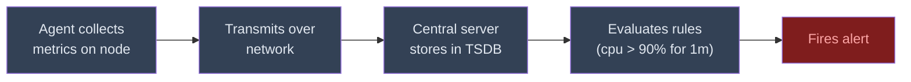
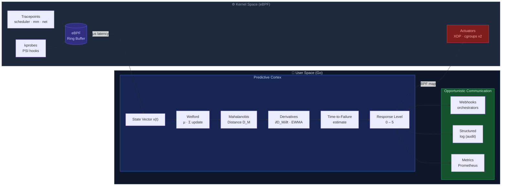

<p align="center">
  <h1 align="center">HOSA</h1>
  <p align="center"><strong>Homeostasis Operating System Agent</strong></p>
  <p align="center">
    An autonomous nervous system for Linux.<br/>
    Detects, contains, and stabilizes system collapse in milliseconds — before your monitoring even notices.
  </p>
</p>

<p align="center">
  <a href="#how-it-works">How It Works</a> •
  <a href="#the-problem">The Problem</a> •
  <a href="#quick-start">Quick Start</a> •
  <a href="#architecture">Architecture</a> •
  <a href="#roadmap">Roadmap</a> •
  <a href="docs/math_model.md">Math Model</a> •
  <a href="docs/architecture.md">Deep Dive</a>
</p>

<p align="center">
  
  = 5.8" />
  
  
</p>

---

## The Lethal Interval

Your server crashes in **2 seconds**. Your monitoring detects it in **100**.

That gap — the milliseconds between the start of a collapse and the arrival of the first useful metric at your control plane — is what we call the **Lethal Interval**. It's where systems die while the observer has no idea anything is wrong.

<table>
<thead>
<tr>
  <th></th>
  <th align="center">0s</th>
  <th align="center">1s</th>
  <th align="center">2s</th>
  <th align="center" colspan="3">2s ⇢ 8s</th>
  <th align="center">8s</th>
  <th align="center">100s</th>
</tr>
</thead>
<tbody>
<tr>
  <td><strong>✅ With HOSA</strong></td>
  <td align="center">⚠️ Leak starts</td>
  <td align="center">🔍 Detects</td>
  <td align="center" colspan="4" style="background:#166534;color:#bbf7d0">🛡️ Contains · memory.high throttle</td>
  <td align="center">✅ Stabilized</td>
  <td align="center">📋 Operator notified<br/><em>with full context</em></td>
</tr>
<tr>
  <td><strong>❌ Without HOSA</strong></td>
  <td align="center" colspan="4" style="background:#7f1d1d;color:#fecaca">💀 Lethal Interval · undetected collapse</td>
  <td align="center" colspan="2" style="background:#450a0a;color:#fca5a5">crash → 502<br/>CrashLoopBackOff</td>
  <td align="center">💥 OOM-Kill</td>
  <td align="center">🚨 Prometheus alert<br/><em>(too late)</em></td>
</tr>
</tbody>
</table>

> **HOSA doesn't replace your monitoring. It keeps your node alive until your monitoring can do its job.**

---

## The Problem

Modern infrastructure monitoring (Prometheus, Datadog, Grafana) follows the same pattern:



Every step adds latency. The central server makes decisions based on a **statistically stale snapshot** of the remote node. When collapse is fast — OOM kills, memory leaks, DDoS floods, fork bombs — the mitigation arrives after the damage is done.

Worse: when the network fails, the node loses **both** the ability to report **and** to receive instructions. It operates in complete blindness.

HOSA fixes this by putting the decision-making **on the node itself**.

---

## How It Works

HOSA is a **bio-inspired, autonomous agent** that runs on every Linux node. It works like the human reflex arc: when you touch something hot, your spinal cord retracts your hand in milliseconds — your brain is notified *after* the reflex. HOSA does the same for your servers.

### Detection: Mahalanobis Distance

Instead of static thresholds (`cpu > 90%`), HOSA learns the **normal behavioral profile** of your node — the correlations between CPU, memory, I/O, network, and scheduler metrics — and detects deviations from that profile using the [Mahalanobis Distance](https://en.wikipedia.org/wiki/Mahalanobis_distance).

**Why this matters:** CPU at 85% with low I/O and stable network might be a legitimate video rendering job. CPU at 85% with rising memory pressure, I/O stalls, and network latency spikes is a collapse in progress. Static thresholds can't tell the difference. Mahalanobis can.

The key insight: HOSA doesn't just look at the **magnitude** of the deviation — it tracks the **velocity** (first derivative) and **acceleration** (second derivative) of the deviation. This means it detects that you're *heading toward* collapse, not just that you've arrived.

### Collection: eBPF in Kernel Space

Metrics are collected via **eBPF probes** attached to kernel tracepoints — no polling, no scraping, no agents-calling-agents. Data flows from kernel space to user space through ring buffers with microsecond latency.

### Actuation: cgroups v2 + XDP

When HOSA detects anomaly acceleration, it acts through the same kernel mechanisms your orchestrator uses — but **100x faster**:

- **cgroups v2**: Throttle CPU/memory of offending processes (not kill — *throttle*)
- **XDP**: Drop network packets at the driver level before they reach the stack

### Graduated Response

HOSA models operational state as a **bipolar spectrum centered on homeostasis** — not just overload protection. Deviations in *both directions* from baseline are classified and acted upon. Negative regimes represent under-demand; positive regimes represent over-demand or anomaly.

<table width="100%">
<tr>
<td align="center" style="padding:4px 2px;font-size:12px;color:#6366f1"><b>−3</b></td>
<td align="center" style="padding:4px 2px;font-size:12px;color:#818cf8"><b>−2</b></td>
<td align="center" style="padding:4px 2px;font-size:12px;color:#a5b4fc"><b>−1</b></td>
<td align="center" style="padding:4px 2px;font-size:12px;color:#c7d2fe"><b>&nbsp;&nbsp;0&nbsp;&nbsp;</b></td>
<td align="center" style="padding:4px 2px;font-size:12px;color:#fde68a"><b>+1</b></td>
<td align="center" style="padding:4px 2px;font-size:12px;color:#fbbf24"><b>+2</b></td>
<td align="center" style="padding:4px 2px;font-size:12px;color:#f97316"><b>+3</b></td>
<td align="center" style="padding:4px 2px;font-size:12px;color:#ef4444"><b>+4</b></td>
<td align="center" style="padding:4px 2px;font-size:12px;color:#dc2626"><b>+5</b></td>
</tr>
<tr>
<td align="center" style="padding:2px;font-size:10px;color:#818cf8">Anomalous<br/>Silence</td>
<td align="center" style="padding:2px;font-size:10px;color:#818cf8">Structural<br/>Idle</td>
<td align="center" style="padding:2px;font-size:10px;color:#a5b4fc">Legitimate<br/>Idle</td>
<td align="center" style="padding:2px;font-size:10px;color:#c7d2fe">Homeo-<br/>stasis</td>
<td align="center" style="padding:2px;font-size:10px;color:#fde68a">Plateau<br/>Shift</td>
<td align="center" style="padding:2px;font-size:10px;color:#fbbf24">Season-<br/>ality</td>
<td align="center" style="padding:2px;font-size:10px;color:#f97316">Adver-<br/>sarial</td>
<td align="center" style="padding:2px;font-size:10px;color:#ef4444">Local<br/>Failure</td>
<td align="center" style="padding:2px;font-size:10px;color:#dc2626">Viral<br/>Propag.</td>
</tr>
</table>

#### Negative Semi-Axis — Under-Demand

| Regime | Name | Trigger | Action |
|--------|------|---------|--------|
| **−1** | Legitimate Idleness | Activity below baseline, coherent with time window (night, weekend) | GreenOps: CPU frequency reduction, sampling interval increase, telemetry suppression |
| **−2** | Structural Idleness | Node **permanently** oversized — no window where resources are fully used | FinOps report: calculated EPI, right-sizing suggestion, projected savings |
| **−3** | Anomalous Silence | Abrupt traffic drop **incoherent** with temporal context — possible DNS hijack, silent failure, attack | Vigilance → Active Containment depending on speed; active checks on processes, interfaces, upstream |

> **−3 is a security scenario.** Traditional monitors report "all healthy" when a server stops receiving traffic (CPU low, memory free). HOSA detects that the silence itself is the anomaly.

#### Regime 0 — Homeostasis

Thalamic Filter active: only a minimal heartbeat is emitted. Baseline continuously refined via Welford.

#### Positive Semi-Axis — Over-Demand & Anomaly

| Regime | Name | Trigger | Action | Reversibility |
|--------|------|---------|--------|---------------|
| **+1** | Plateau Shift | D_M elevated but **stable derivative** — new legitimate workload | Habituation: recalibrate baseline to new regime | Automatic |
| **+2** | Seasonality | Predictable cyclic peaks (daily, weekly, monthly) | Time-window baseline profiles (digital circadian rhythm) | Automatic |
| **+3** | Adversarial | Individual metrics within range but **covariance structure deformed** — cryptomining, slow DDoS, low-and-slow exfil | Active Containment + covariance deformation monitoring. Habituation **blocked** | Auto with hysteresis |
| **+4** | Localized Failure | Growing D_M with sustained positive derivative — memory leak, fork bomb, disk degradation | Graduated containment: `renice` → cgroup throttle → XDP load shedding → aggressive freeze | Auto with hysteresis |
| **+5** | Viral Propagation | High PBI (Propagation Behavior Index) — worm, lateral movement, amplification DDoS | Network isolation. Habituation **categorically blocked** | **Manual** |

Every action is **logged with its mathematical justification** — the exact D_M value, derivative, threshold crossed, and regime classification. The agent is fully auditable.

---

## Quick Start

### Prerequisites

- Linux kernel ≥ 5.8 (with eBPF CO-RE support)
- Go ≥ 1.22
- clang/llvm (for eBPF C compilation)
- Root privileges (eBPF requires `CAP_BPF`, cgroups require `CAP_SYS_ADMIN`)

---

## Architecture



### Key Design Decisions

| Decision | Rationale |
|----------|-----------|
| **Mahalanobis over ML/DL** | O(n²) constant memory, no GPU, no training pipeline, runs on a Raspberry Pi. [Full rationale →](docs/math_model.md) |
| **Welford incremental updates** | O(n²) per sample with O(1) allocation. No data windows stored. Predictable memory footprint. |
| **EWMA over raw derivatives** | Numerical differentiation is ill-posed on noisy discrete data. EWMA smooths signal before differentiation. |
| **Go over Rust/C** | Pragmatic: faster iteration for research phase. Hot path uses zero-allocation patterns. GC pauses are sub-ms on Go 1.22+. |
| **Complement, not replace** | HOSA is not a monitoring system. It's the reflex arc that keeps you alive while your monitoring system thinks. |

---

## Project Structure

```
hosa/
├── cmd/hosa/
│   └── main.go               # Entry point — initializes the agent
├── internal/
│   ├── sysbpf/
│   │   └── syscall.go         # Custom eBPF loader via native syscalls
│   ├── linalg/
│   │   └── matrix.go          # Linear algebra primitives (matrices, inversion, covariance)
│   ├── syscgroup/
│   │   └── file_edit.go       # Direct cgroup file manipulation via Linux VFS
│   ├── bpf/
│   │   ├── sensors.c          # eBPF C code injected into the kernel
│   │   └── bpf_bpfeb.go       # Auto-generated Go↔C bridge (cilium/ebpf)
│   ├── sensor/                # The Sensory System
│   │   └── collector.go       # Reads eBPF maps, structures raw data into state vector
│   ├── brain/                 # The Predictive Cortex
│   │   ├── matrix.go          # Covariance matrix management
│   │   ├── mahalanobis.go     # Homeostasis calculation (Mahalanobis Distance)
│   │   └── predictor.go       # Derivatives + Time-to-Failure estimation
│   ├── motor/                 # The Reflex Arc (Actuators)
│   │   ├── cgroups.go         # PID throttling via cgroups v2
│   │   └── signals.go         # Process signaling (SIGTERM/SIGKILL)
│   └── state/                 # The Limbic System
│       └── memory.go          # Short-term ring buffer for mathematical baseline
├── docs/
│   ├── architecture.md        # Deep dive into the bio-inspired architecture
│   └── math_model.md          # Full mathematical formulation
├── go.mod
├── go.sum
└── Makefile                   # make build compiles eBPF C + Go in one step
```

---

## What HOSA Is Not

Let's be explicit:

- ❌ **Not a monitoring system.** It doesn't replace Prometheus, Datadog, or Grafana. It complements them.
- ❌ **Not a HIDS.** It doesn't detect intrusions by signature. It detects system behavioral anomalies.
- ❌ **Not an orchestrator.** It doesn't schedule pods or manage clusters. It keeps individual nodes alive.
- ❌ **Not magic.** It has a [cold start window](docs/math_model.md#cold-start), can be [evaded by sophisticated attackers](docs/math_model.md#limitations), and [throttling has side effects](docs/math_model.md#throttling-risks).

**HOSA operates in the temporal gap where monitoring systems are structurally — not accidentally — too slow to act.**

---

## Roadmap

### Phase 1 — The Reflex Arc `← we are here`

- [x] eBPF probes for memory, CPU, I/O collection
- [x] Welford incremental covariance matrix
- [x] Mahalanobis Distance calculation
- [x] Hardware proprioception (automatic topology discovery)
- [x] EWMA smoothing + temporal derivatives
- [x] Graduated response system (Levels 0–3)
- [ ] Thalamic Filter (telemetry suppression in homeostasis)
- [ ] Benchmarks: detection latency, overhead, false positive rate

### Phase 2 — Ecosystem Symbiosis

- [ ] Webhooks for K8s HPA/KEDA (preemptive scale-up)
- [ ] Prometheus-compatible metrics endpoint
- [ ] Enriched `/healthz` with state vector
- [ ] Kubernetes DaemonSet deployment

### Phase 3 — Semantic Triage

- [ ] Local SLM for post-containment root cause analysis
- [ ] Bloom Filter in eBPF for known-pattern fast-path blocking
- [ ] Autonomous Quarantine (Level 5) with environment-aware modes
- [ ] Habituation: automatic baseline recalibration

### Future Research (PhD scope)

- [ ] **Swarm Intelligence**: P2P consensus between HOSA instances
- [ ] **Federated Learning**: collective immunity across fleet
- [ ] **Hardware Offload**: SmartNIC/DPU acceleration

---

## Academic Context

HOSA originates from a Master's research project at **IMECC/Unicamp** (University of Campinas, Brazil). The theoretical foundation is documented in the [HOSA Whitepaper v2.1](docs/whitepaper.pdf).

**Core references:**
- Mahalanobis, P. C. (1936). *On the generalized distance in statistics.*
- Welford, B. P. (1962). *Note on a Method for Calculating Corrected Sums of Squares and Products.*
- Horn, P. (2001). *Autonomic Computing: IBM's Perspective on the State of Information Technology.*
- Forrest, S., Hofmeyr, S. A., & Somayaji, A. (1997). *Computer immunology.*

---

## Contributing

HOSA is in **early alpha**. The architecture is solidifying but the API is not stable yet.

If you want to contribute:

1. Read the [whitepaper](docs/whitepaper.pdf) first — it explains *why* before *how*
2. Check [open issues](https://github.com/bricio-sr/hosa/issues) for `good-first-issue` tags
3. Join the discussion in [Discussions](https://github.com/bricio-sr/hosa/discussions)

Areas where help is especially welcome:
- **eBPF expertise**: Optimizing probe overhead, CO-RE compatibility testing across kernel versions
- **Statistical validation**: Testing Mahalanobis robustness under non-Gaussian workload distributions
- **Chaos engineering**: Designing fault injection scenarios for benchmarking

---

## License

[GPL-3.0 license](LICENSE) — Use it, extend it.

---

<p align="center">
  <em>
    "Orchestrators and centralized monitoring are essential for capacity planning and long-term governance.<br/>
    But they are structurally — not accidentally — too slow to guarantee a node's survival in real time.<br/>
    If collapse happens in the interval between perception and exogenous action,<br/>
    the capacity for immediate decision must reside in the node itself."
  </em>
</p>

<p align="center">
  <a href="docs/whitepaper.pdf">Read the Whitepaper</a> •
  <a href="https://github.com/bricio-sr/hosa/issues">Report a Bug</a> •
  <a href="https://github.com/bricio-sr/hosa/discussions">Discuss</a>
</p>
